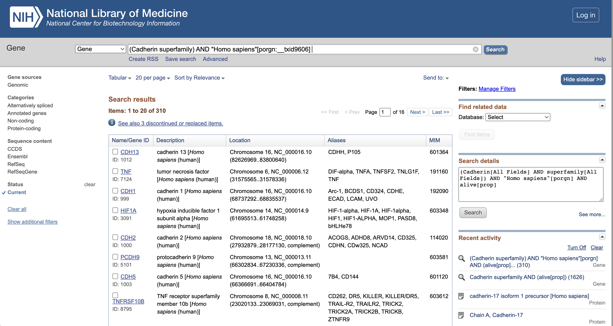

### Goal: comparing full length sequences and domain sequences of CDH17 to its superfamily and find the identity in order to find out the non-sepcific binding

#### 1. Download CDH superfamily from NCBI

download “caherin\_superfamily\_homo\_sapiens\_bar.xlsx”

#### 2. Install packages

    library(biomaRt)
    library(UniprotR)

#### 3. Run Rscript “script.R”

get two fasta as input of following steps: queryDB, targetDB

#### 4-1. Run ncbi-blast+

1.  install blast+ via conda

<!-- -->

    conda install -c bioconda blast

1.  run command line “cmd.sh”

<!-- -->

    sh ./result/ncbi_blast/full/cmd.sh
    sh ./result/ncbi_blast/domain/cmd.sh

#### 4-2. Run mmseqs2

1.  run command line “cmd.sh”

<!-- -->

    sh ./result/mmseqs2/full/cmd.sh
    sh ./result/mmseqs2/domain/cmd.sh

#### 4-3. Run emboss-water

1.  install emboss via conda

<!-- -->

    conda install -c bioconda emboss

1.  run command line “cmd.sh”

<!-- -->

    sh ./result/emboss_water/domain/cmd.sh
